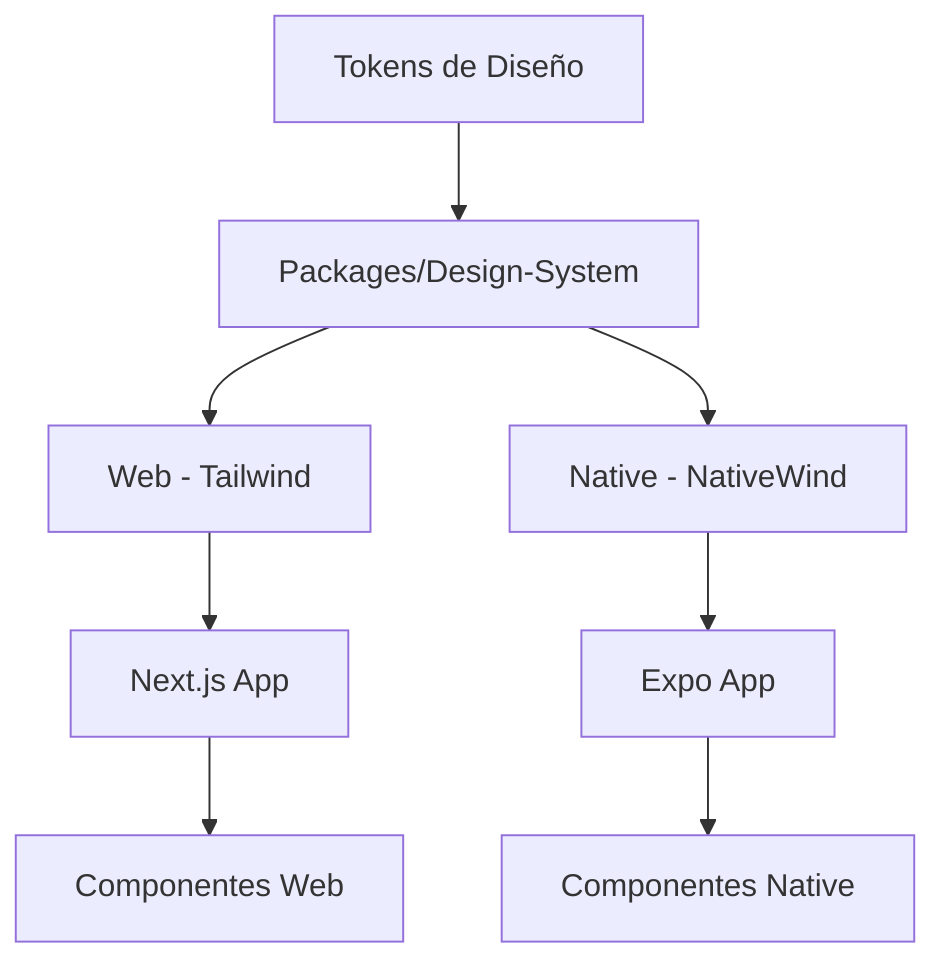

# 🎨 Sistema de Estilos y Diseño - ONFIT

## 📋 Resumen Ejecutivo

Este documento describe el sistema de estilos, componentes de diseño, tema y arquitectura visual del proyecto ONFIT, incluyendo la implementación de Tailwind CSS, NativeWind, y el sistema de componentes compartidos.

---

## 🏗️ Arquitectura de Estilos

### 🎯 Stack Tecnológico

#### **Web (Next.js 15)**
- **CSS Framework**: Tailwind CSS 3
- **PostCSS**: Configuración optimizada
- **Componentes**: Sistema compartido en `packages/design-system`

#### **Native (Expo 53)**
- **CSS Framework**: NativeWind 4
- **Runtime**: React Native con CSS-in-JS
- **Componentes**: Versiones nativas de componentes compartidos

#### **Compartido**
- **Monorepo**: pnpm workspace
- **Tokens**: Sistema de diseño centralizado
- **Tipografía**: Fuentes personalizadas
- **Iconografía**: Lucide React

### 🔄 Flujo de Estilos



---

## 🎨 Sistema de Diseño

### 🌈 Paleta de Colores

#### **Colores Base (Tailwind)**
```css
/* Colores principales */
--primary: 220 14% 96% /* #f1f5f9 */
--primary-foreground: 220 9% 46% /* #64748b */

/* Colores secundarios */
--secondary: 220 14% 96% /* #f1f5f9 */
--secondary-foreground: 220 9% 46% /* #64748b */

/* Colores de fondo */
--background: 0 0% 100% /* #ffffff */
--foreground: 220 9% 46% /* #64748b */

/* Colores de borde */
--border: 220 13% 91% /* #e2e8f0 */
--input: 220 13% 91% /* #e2e8f0 */

/* Colores de estado */
--destructive: 0 84% 60% /* #ef4444 */
--destructive-foreground: 0 0% 98% /* #fafafa */
```

#### **Colores Semánticos**
```css
/* Éxito */
--success: 142 76% 36% /* #16a34a */
--success-foreground: 0 0% 98% /* #fafafa */

/* Advertencia */
--warning: 38 92% 50% /* #f59e0b */
--warning-foreground: 0 0% 98% /* #fafafa */

/* Información */
--info: 217 91% 60% /* #3b82f6 */
--info-foreground: 0 0% 98% /* #fafafa */
```

### 📝 Tipografía

#### **Fuentes del Sistema**
```css
/* Fuentes principales */
--font-sans: 'Inter', 'Noto Sans', system-ui, sans-serif;
--font-mono: 'JetBrains Mono', 'Fira Code', monospace;
--font-serif: 'Noto Serif', serif;

/* Tamaños de fuente */
--text-xs: 0.75rem;    /* 12px */
--text-sm: 0.875rem;   /* 14px */
--text-base: 1rem;     /* 16px */
--text-lg: 1.125rem;   /* 18px */
--text-xl: 1.25rem;    /* 20px */
--text-2xl: 1.5rem;    /* 24px */
--text-3xl: 1.875rem;  /* 30px */
--text-4xl: 2.25rem;   /* 36px */
```

#### **Jerarquía Tipográfica**
```typescript
// Títulos principales
<h1 className="text-4xl font-bold tracking-tight">Título Principal</h1>
<h2 className="text-3xl font-semibold tracking-tight">Subtítulo</h2>
<h3 className="text-2xl font-semibold">Sección</h3>

// Texto de cuerpo
<p className="text-base leading-relaxed">Texto de cuerpo normal</p>
<p className="text-sm text-muted-foreground">Texto secundario</p>
```

### 📐 Espaciado y Layout

#### **Sistema de Espaciado**
```css
/* Espaciado base (Tailwind) */
--spacing-0: 0px;
--spacing-1: 0.25rem;  /* 4px */
--spacing-2: 0.5rem;   /* 8px */
--spacing-3: 0.75rem;  /* 12px */
--spacing-4: 1rem;     /* 16px */
--spacing-5: 1.25rem;  /* 20px */
--spacing-6: 1.5rem;   /* 24px */
--spacing-8: 2rem;     /* 32px */
--spacing-10: 2.5rem;  /* 40px */
--spacing-12: 3rem;    /* 48px */
--spacing-16: 4rem;    /* 64px */
--spacing-20: 5rem;    /* 80px */
--spacing-24: 6rem;    /* 96px */
```

#### **Layout Responsivo**
```typescript
// Grid responsivo
<div className="grid grid-cols-1 md:grid-cols-2 lg:grid-cols-3 gap-4 md:gap-6 lg:gap-8">
  {/* Contenido */}
</div>

// Flexbox responsivo
<div className="flex flex-col md:flex-row items-center justify-between gap-4">
  {/* Contenido */}
</div>
```

---

## 🧩 Sistema de Componentes

### 🎯 Estructura de Componentes

#### **Ubicación**: `packages/design-system/components/`

```
components/
├── Avatar/
│   ├── index.native.tsx    # Versión React Native
│   ├── index.web.tsx       # Versión Web
│   └── index.ts            # Exportación
├── Button/
│   ├── index.native.tsx    # Versión React Native
│   ├── index.web.tsx       # Versión Web
│   └── index.ts            # Exportación
├── Card/
│   ├── index.native.tsx    # Versión React Native
│   └── index.web.tsx       # Versión Web
└── ...                     # Otros componentes
```

### 🔘 Componentes Principales

#### **Button Component**
```typescript
// Web - HTML button
<Button 
  variant="default" 
  size="lg" 
  className="w-full"
  onClick={handleClick}
>
  Botón Principal
</Button>

// Native - Pressable
<Button 
  variant="outline" 
  size="sm" 
  onPress={handlePress}
>
  Botón Secundario
</Button>
```

#### **Card Component**
```typescript
// Web y Native
<Card className="p-6 shadow-lg">
  <CardHeader>
    <CardTitle>Título de la Tarjeta</CardTitle>
    <CardDescription>Descripción de la tarjeta</CardDescription>
  </CardHeader>
  <CardContent>
    <p>Contenido de la tarjeta</p>
  </CardContent>
  <CardFooter>
    <Button>Acción</Button>
  </CardFooter>
</Card>
```

#### **Input Component**
```typescript
// Web - HTML input
<Input 
  type="email" 
  placeholder="tu@email.com"
  className="w-full"
/>

// Native - TextInput
<Input 
  placeholder="Tu email"
  keyboardType="email-address"
  autoCapitalize="none"
/>
```

### 🎨 Variantes de Componentes

#### **Button Variants**
```typescript
// Variantes disponibles
variant: "default" | "destructive" | "outline" | "secondary" | "ghost" | "link"

// Tamaños disponibles
size: "default" | "sm" | "lg" | "icon"

// Estados
disabled: boolean
loading: boolean
```

#### **Card Variants**
```typescript
// Variantes de tarjeta
variant: "default" | "outline" | "elevated"

// Tamaños
size: "default" | "sm" | "lg"
```

---

## 🌓 Sistema de Tema

### 🎨 Gestión de Tema

#### **Provider de Tema**: `apps/web/src/providers/theme.tsx`
```typescript
import { ThemeProvider } from "next-themes"

export function ThemeProvider({ children }: { children: React.ReactNode }) {
  return (
    <ThemeProvider
      attribute="class"
      defaultTheme="system"
      enableSystem
      disableTransitionOnChange
    >
      {children}
    </ThemeProvider>
  )
}
```

#### **Hook de Tema**: `packages/design-system/hooks/useColorScheme/`
```typescript
// Web
export function useColorScheme() {
  const { theme, setTheme } = useTheme()
  
  return {
    theme,
    setTheme,
    isDark: theme === 'dark',
    isLight: theme === 'light',
    isSystem: theme === 'system'
  }
}

// Native
export function useColorScheme() {
  const colorScheme = useColorScheme()
  
  return {
    theme: colorScheme,
    isDark: colorScheme === 'dark',
    isLight: colorScheme === 'light'
  }
}
```

### 🌙 Modo Oscuro

#### **Variables CSS para Modo Oscuro**
```css
/* Modo claro (por defecto) */
:root {
  --background: 0 0% 100%;
  --foreground: 220 9% 46%;
  --card: 0 0% 100%;
  --card-foreground: 220 9% 46%;
  --popover: 0 0% 100%;
  --popover-foreground: 220 9% 46%;
  --primary: 220 14% 96%;
  --primary-foreground: 220 9% 46%;
  --secondary: 220 14% 96%;
  --secondary-foreground: 220 9% 46%;
  --muted: 220 14% 96%;
  --muted-foreground: 220 8% 46%;
  --accent: 220 14% 96%;
  --accent-foreground: 220 9% 46%;
  --destructive: 0 84% 60%;
  --destructive-foreground: 0 0% 98%;
  --border: 220 13% 91%;
  --input: 220 13% 91%;
  --ring: 220 14% 96%;
  --radius: 0.5rem;
}

/* Modo oscuro */
[data-theme="dark"] {
  --background: 220 9% 46%;
  --foreground: 220 14% 96%;
  --card: 220 9% 46%;
  --card-foreground: 220 14% 96%;
  --popover: 220 9% 46%;
  --popover-foreground: 220 14% 96%;
  --primary: 220 14% 96%;
  --primary-foreground: 220 9% 46%;
  --secondary: 220 9% 46%;
  --secondary-foreground: 220 14% 96%;
  --muted: 220 9% 46%;
  --muted-foreground: 220 8% 46%;
  --accent: 220 9% 46%;
  --accent-foreground: 220 14% 96%;
  --destructive: 0 84% 60%;
  --destructive-foreground: 0 0% 98%;
  --border: 220 9% 46%;
  --input: 220 9% 46%;
  --ring: 220 14% 96%;
}
```

---

## 🎭 Componentes de UI

### 🎨 Componentes de Formulario

#### **Input Group**
```typescript
<div className="space-y-2">
  <Label htmlFor="email">Email</Label>
  <Input 
    id="email" 
    type="email" 
    placeholder="tu@email.com"
    className="w-full"
  />
  <p className="text-sm text-muted-foreground">
    Nunca compartiremos tu email.
  </p>
</div>
```

#### **Select Component**
```typescript
<Select>
  <SelectTrigger className="w-full">
    <SelectValue placeholder="Selecciona un rol" />
  </SelectTrigger>
  <SelectContent>
    <SelectItem value="user">Usuario</SelectItem>
    <SelectItem value="trainer">Trainer</SelectItem>
    <SelectItem value="admin">Admin</SelectItem>
  </SelectContent>
</Select>
```

#### **Checkbox Component**
```typescript
<div className="flex items-center space-x-2">
  <Checkbox id="terms" />
  <Label htmlFor="terms">Acepto los términos y condiciones</Label>
</div>
```

### 📊 Componentes de Datos

#### **Table Component**
```typescript
<Table>
  <TableHeader>
    <TableRow>
      <TableHead>Nombre</TableHead>
      <TableHead>Email</TableHead>
      <TableHead>Rol</TableHead>
      <TableHead>Acciones</TableHead>
    </TableRow>
  </TableHeader>
  <TableBody>
    {users.map((user) => (
      <TableRow key={user.id}>
        <TableCell>{user.name}</TableCell>
        <TableCell>{user.email}</TableCell>
        <TableCell>{user.role}</TableCell>
        <TableCell>
          <Button variant="ghost" size="sm">
            <Edit className="h-4 w-4" />
          </Button>
        </TableCell>
      </TableRow>
    ))}
  </TableBody>
</Table>
```

#### **Badge Component**
```typescript
// Estados
<Badge variant="default">Activo</Badge>
<Badge variant="secondary">Pendiente</Badge>
<Badge variant="destructive">Error</Badge>
<Badge variant="outline">Información</Badge>

// Tamaños
<Badge size="sm">Pequeño</Badge>
<Badge size="default">Normal</Badge>
<Badge size="lg">Grande</Badge>
```

### 🎪 Componentes de Navegación

#### **Navigation Menu**
```typescript
<NavigationMenu>
  <NavigationMenuList>
    <NavigationMenuItem>
      <NavigationMenuTrigger>Dashboard</NavigationMenuTrigger>
      <NavigationMenuContent>
        <NavigationMenuLink asChild>
          <Link href="/dashboard">Vista General</Link>
        </NavigationMenuLink>
      </NavigationMenuContent>
    </NavigationMenuItem>
  </NavigationMenuList>
</NavigationMenu>
```

#### **Breadcrumb Component**
```typescript
<Breadcrumb>
  <BreadcrumbList>
    <BreadcrumbItem>
      <BreadcrumbLink href="/">Inicio</BreadcrumbLink>
    </BreadcrumbItem>
    <BreadcrumbSeparator />
    <BreadcrumbItem>
      <BreadcrumbLink href="/admin">Admin</BreadcrumbLink>
    </BreadcrumbItem>
    <BreadcrumbSeparator />
    <BreadcrumbItem>
      <BreadcrumbPage>Usuarios</BreadcrumbPage>
    </BreadcrumbItem>
  </BreadcrumbList>
</Breadcrumb>
```

---

## 🎨 Utilidades de Estilos

### 🎯 Clases de Tailwind Personalizadas

#### **Layout y Espaciado**
```css
/* Contenedores */
.container {
  @apply mx-auto px-4 sm:px-6 lg:px-8;
}

.container-sm {
  @apply mx-auto px-4 sm:px-6;
}

.container-lg {
  @apply mx-auto px-4 sm:px-6 lg:px-8 xl:px-12;
}

/* Espaciado vertical */
.section {
  @apply py-12 md:py-16 lg:py-20;
}

.section-sm {
  @apply py-8 md:py-12;
}

.section-lg {
  @apply py-16 md:py-20 lg:py-24;
}
```

#### **Tipografía**
```css
/* Títulos */
.heading-1 {
  @apply text-4xl font-bold tracking-tight md:text-5xl lg:text-6xl;
}

.heading-2 {
  @apply text-3xl font-semibold tracking-tight md:text-4xl;
}

.heading-3 {
  @apply text-2xl font-semibold tracking-tight md:text-3xl;
}

/* Texto de cuerpo */
.body-large {
  @apply text-lg leading-relaxed;
}

.body {
  @apply text-base leading-relaxed;
}

.body-small {
  @apply text-sm leading-relaxed;
}
```

#### **Componentes**
```css
/* Botones */
.btn-primary {
  @apply inline-flex items-center justify-center rounded-md bg-primary px-4 py-2 text-sm font-medium text-primary-foreground shadow hover:bg-primary/90 focus-visible:outline-none focus-visible:ring-1 focus-visible:ring-ring disabled:pointer-events-none disabled:opacity-50;
}

.btn-secondary {
  @apply inline-flex items-center justify-center rounded-md bg-secondary px-4 py-2 text-sm font-medium text-secondary-foreground shadow-sm hover:bg-secondary/80 focus-visible:outline-none focus-visible:ring-1 focus-visible:ring-ring disabled:pointer-events-none disabled:opacity-50;
}

/* Tarjetas */
.card {
  @apply rounded-lg border bg-card text-card-foreground shadow-sm;
}

.card-header {
  @apply flex flex-col space-y-1.5 p-6;
}

.card-content {
  @apply p-6 pt-0;
}

.card-footer {
  @apply flex items-center p-6 pt-0;
}
```

---

## 🎨 Iconografía

### 🔤 Sistema de Iconos

#### **Librería**: Lucide React
```typescript
import { 
  User, 
  Settings, 
  Bell, 
  Search, 
  Plus, 
  Edit, 
  Trash2,
  ChevronDown,
  Check,
  X
} from 'lucide-react'

// Uso en componentes
<Button variant="ghost" size="sm">
  <Edit className="h-4 w-4" />
</Button>

// Iconos con texto
<div className="flex items-center gap-2">
  <User className="h-5 w-5" />
  <span>Perfil de Usuario</span>
</div>
```

#### **Tamaños de Iconos**
```typescript
// Tamaños estándar
className="h-3 w-3"   // 12px - Muy pequeño
className="h-4 w-4"   // 16px - Pequeño
className="h-5 w-5"   // 20px - Normal
className="h-6 w-6"   // 24px - Grande
className="h-8 w-8"   // 32px - Muy grande
```

#### **Colores de Iconos**
```typescript
// Colores semánticos
className="text-primary"           // Color primario
className="text-muted-foreground"  // Color secundario
className="text-destructive"       // Color de error
className="text-success"           // Color de éxito
className="text-warning"           // Color de advertencia
```

---

## 📱 Responsive Design

### 🖥️ Breakpoints del Sistema

#### **Breakpoints de Tailwind**
```css
/* Breakpoints estándar */
sm: 640px   /* Small devices */
md: 768px   /* Medium devices */
lg: 1024px  /* Large devices */
xl: 1280px  /* Extra large devices */
2xl: 1536px /* 2X large devices */
```

#### **Estrategias Responsivas**
```typescript
// Mobile First
<div className="
  w-full                    /* Mobile: 100% */
  md:w-1/2                 /* Tablet: 50% */
  lg:w-1/3                 /* Desktop: 33.33% */
  xl:w-1/4                 /* XL: 25% */
">

// Grid Responsivo
<div className="
  grid 
  grid-cols-1              /* Mobile: 1 columna */
  md:grid-cols-2           /* Tablet: 2 columnas */
  lg:grid-cols-3           /* Desktop: 3 columnas */
  gap-4 md:gap-6 lg:gap-8
">

// Flexbox Responsivo
<div className="
  flex 
  flex-col                 /* Mobile: columna */
  md:flex-row              /* Tablet: fila */
  items-center 
  justify-between
">
```

### 📱 Componentes Responsivos

#### **Navigation Responsive**
```typescript
// Desktop: Menú horizontal
<nav className="hidden md:flex items-center space-x-6">
  <Link href="/dashboard">Dashboard</Link>
  <Link href="/users">Usuarios</Link>
  <Link href="/settings">Configuración</Link>
</nav>

// Mobile: Menú hamburguesa
<Button 
  variant="ghost" 
  size="sm" 
  className="md:hidden"
  onClick={() => setMobileMenuOpen(true)}
>
  <Menu className="h-6 w-6" />
</Button>
```

#### **Table Responsive**
```typescript
// Desktop: Tabla completa
<div className="hidden lg:block">
  <Table>
    {/* Tabla completa */}
  </Table>
</div>

// Mobile: Cards
<div className="lg:hidden space-y-4">
  {users.map((user) => (
    <Card key={user.id}>
      <CardContent className="p-4">
        <div className="flex items-center justify-between">
          <div>
            <p className="font-medium">{user.name}</p>
            <p className="text-sm text-muted-foreground">{user.email}</p>
          </div>
          <Badge>{user.role}</Badge>
        </div>
      </CardContent>
    </Card>
  ))}
</div>
```

---

## 🎨 Animaciones y Transiciones

### ✨ Transiciones CSS

#### **Transiciones Básicas**
```css
/* Transiciones estándar */
.transition {
  @apply transition-all duration-200 ease-in-out;
}

.transition-fast {
  @apply transition-all duration-150 ease-in-out;
}

.transition-slow {
  @apply transition-all duration-300 ease-in-out;
}

/* Transiciones específicas */
.transition-colors {
  @apply transition-colors duration-200 ease-in-out;
}

.transition-transform {
  @apply transition-transform duration-200 ease-in-out;
}

.transition-opacity {
  @apply transition-opacity duration-200 ease-in-out;
}
```

#### **Hover Effects**
```typescript
// Botones
<Button className="
  transition-all duration-200 
  hover:scale-105 
  hover:shadow-lg
  active:scale-95
">

// Tarjetas
<Card className="
  transition-all duration-200 
  hover:shadow-lg 
  hover:-translate-y-1
  cursor-pointer
">

// Enlaces
<Link className="
  transition-colors duration-200 
  hover:text-primary 
  hover:underline
">
```

### 🎭 Animaciones CSS

#### **Keyframes Personalizados**
```css
@keyframes fadeIn {
  from {
    opacity: 0;
    transform: translateY(10px);
  }
  to {
    opacity: 1;
    transform: translateY(0);
  }
}

@keyframes slideIn {
  from {
    transform: translateX(-100%);
  }
  to {
    transform: translateX(0);
  }
}

@keyframes pulse {
  0%, 100% {
    opacity: 1;
  }
  50% {
    opacity: 0.5;
  }
}
```

#### **Clases de Animación**
```css
.animate-fade-in {
  animation: fadeIn 0.3s ease-out;
}

.animate-slide-in {
  animation: slideIn 0.3s ease-out;
}

.animate-pulse {
  animation: pulse 2s cubic-bezier(0.4, 0, 0.6, 1) infinite;
}
```

---

## 🧪 Testing de Estilos

### 🎯 Estrategias de Testing

#### **Testing Visual**
```typescript
// Storybook para componentes
import type { Meta, StoryObj } from '@storybook/react'
import { Button } from './Button'

const meta: Meta<typeof Button> = {
  title: 'Components/Button',
  component: Button,
  parameters: {
    layout: 'centered',
  },
  tags: ['autodocs'],
}

export default meta
type Story = StoryObj<typeof meta>

export const Primary: Story = {
  args: {
    variant: 'default',
    children: 'Button',
  },
}

export const Secondary: Story = {
  args: {
    variant: 'secondary',
    children: 'Button',
  },
}
```

#### **Testing de Accesibilidad**
```typescript
// Test de contraste
test('button has sufficient color contrast', () => {
  render(<Button>Click me</Button>)
  const button = screen.getByRole('button')
  expect(button).toHaveAttribute('aria-label')
})

// Test de navegación por teclado
test('button is keyboard accessible', () => {
  render(<Button>Click me</Button>)
  const button = screen.getByRole('button')
  button.focus()
  expect(button).toHaveFocus()
})
```

---

## 📚 Recursos y Referencias

### 🔗 Documentación Oficial

- **Tailwind CSS**: [https://tailwindcss.com/docs](https://tailwindcss.com/docs)
- **NativeWind**: [https://www.nativewind.dev/](https://www.nativewind.dev/)
- **Lucide Icons**: [https://lucide.dev/](https://lucide.dev/)
- **Next.js**: [https://nextjs.org/docs](https://nextjs.org/docs)
- **Expo**: [https://docs.expo.dev/](https://docs.expo.dev/)

### 🛠️ Herramientas de Desarrollo

- **Tailwind CSS IntelliSense**: Extensión de VS Code
- **PostCSS Language Support**: Soporte para PostCSS
- **CSS Peek**: Navegación rápida de CSS
- **Color Picker**: Selector de colores integrado

### 📖 Guías de Estilo

- **Conventional Commits**: [https://www.conventionalcommits.org/](https://www.conventionalcommits.org/)
- **CSS Architecture**: [https://css-tricks.com/css-architecture/](https://css-tricks.com/css-architecture/)
- **Design Systems**: [https://www.designsystems.com/](https://www.designsystems.com/)

---

## 📅 Historial de Cambios

### **v1.0.0** - 22/08/2025
- ✅ Sistema de estilos completo implementado
- ✅ Componentes compartidos entre Web y Native
- ✅ Sistema de tema con modo oscuro
- ✅ Responsive design implementado
- ✅ Animaciones y transiciones
- ✅ Documentación completa de estilos

---

## 👥 Mantenimiento y Evolución

### 🔧 Responsabilidades

- **Desarrollador Principal**: Raúl P. Carreras
- **Revisión de Estilos**: Antes de cada release
- **Actualización de Tokens**: Según necesidades del diseño
- **Mantenimiento de Componentes**: Según feedback de usuarios

### 🚀 Roadmap

- **Q4 2025**: Sistema de tokens avanzado
- **Q1 2026**: Componentes de gráficos y visualización
- **Q2 2026**: Sistema de animaciones avanzadas
- **Q3 2026**: Componentes de formularios avanzados

---

**⚠️ IMPORTANTE**: Este documento debe mantenerse actualizado con cualquier cambio en el sistema de estilos, componentes o tema del proyecto.
