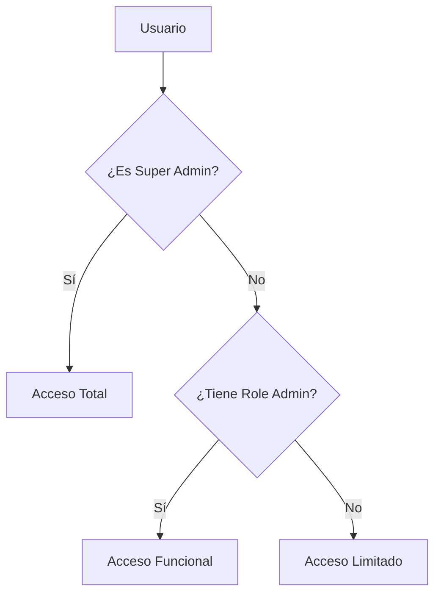

# 🔐 Documentación de Seguridad y Supabase - ONFIT

## 📋 Resumen Ejecutivo

Este documento describe el estado actual de seguridad, la arquitectura de autenticación y autorización, y la integración con Supabase en el proyecto ONFIT.

---

## 🏗️ Arquitectura de Seguridad

### 🔐 Sistema de Autenticación Dual

ONFIT implementa un sistema de autenticación de dos niveles que proporciona flexibilidad y seguridad:

#### **Nivel 1: Super Admin (JWT)**

- **Ubicación**: `user.app_metadata.is_super_admin` en JWT
- **Propósito**: Permisos máximos del sistema
- **Gestión**: Endpoint `/api/admin/grant-super`
- **Independencia**: No afecta roles funcionales

#### **Nivel 2: Roles Funcionales (Base de Datos)**

- **Ubicación**: `public.profiles.role`
- **Valores**: `user`, `trainer`, `admin`
- **Propósito**: Funcionalidades específicas por rol
- **Gestión**: Endpoint `/api/admin/promote-role`

### 🛡️ Separación de Responsabilidades



---

## 🔌 Integración con Supabase

### 📊 Configuración de Base de Datos

#### **Variables de Entorno Requeridas**

```bash
# Cliente (públicas)
NEXT_PUBLIC_SUPABASE_URL=your-project-url
NEXT_PUBLIC_SUPABASE_ANON_KEY=your-anon-key

# Servidor (privadas)
SUPABASE_SERVICE_ROLE_KEY=your-service-role-key
ADMIN_INTERNAL_SECRET=your-internal-secret
```

#### **Migración de Base de Datos**

- **Archivo**: `supabase/migrations/20250821231824_super-admin.sql`
- **Función**: `public.is_super_admin()` para leer JWT
- **Políticas RLS**: Configuradas en `public.profiles`

### 🔒 Row Level Security (RLS)

#### **Políticas Implementadas**

```sql
-- Lectura: Usuario propio o super admin
create policy "profiles select own"
on public.profiles for select
to authenticated, anon
using (auth.uid() = id or public.is_super_admin());

-- Inserción: Usuario propio o super admin
create policy "profiles insert self"
on public.profiles for insert
to authenticated
with check (auth.uid() = id or public.is_super_admin());

-- Actualización: Usuario propio o super admin
create policy "profiles update own"
on public.profiles for update
to authenticated
using (auth.uid() = id or public.is_super_admin())
with check (auth.uid() = id or public.is_super_admin());
```

---

## 🚀 APIs de Seguridad

### 🔑 Gestión de Super Admin

#### **Endpoint**: `POST /api/admin/grant-super`

- **Propósito**: Activar/desactivar super admin
- **Protección**: Solo super admins pueden acceder
- **Operación**: Modifica `app_metadata.is_super_admin`
- **Independencia**: NO toca `profiles.role`

```typescript
// Ejemplo de uso
const response = await fetch("/api/admin/grant-super", {
    method: "POST",
    headers: { "Content-Type": "application/json" },
    body: JSON.stringify({ email: "user@example.com", enable: true }),
});
```

### 👥 Gestión de Roles

#### **Endpoint**: `POST /api/admin/promote-role`

- **Propósito**: Cambiar roles funcionales
- **Protección**: Solo super admins pueden acceder
- **Operación**: Modifica `profiles.role`
- **Independencia**: NO toca `is_super_admin`

```typescript
// Ejemplo de uso
const response = await fetch("/api/admin/promote-role", {
    method: "POST",
    headers: { "Content-Type": "application/json" },
    body: JSON.stringify({ userId: "user-id", role: "admin" }),
});
```

### 📋 Listado de Usuarios

#### **Endpoint**: `GET /api/admin/users`

- **Propósito**: Obtener lista de usuarios con permisos
- **Protección**: Super admin O admin funcional
- **Datos**: Combina `profiles` + `auth.users`
- **Información**: Roles, super admin status, datos básicos

---

## 🛡️ Protección de Rutas

### 🔒 Server-Side Rendering (SSR) Guards

#### **Layout Admin**: `apps/web/app/(protected)/admin/layout.tsx`

```typescript
export default async function AdminLayout({ children }: { children: ReactNode }) {
  const supabase = await supabaseServerClient();
  const { data: { user } } = await supabase.auth.getUser();

  if (!user) redirect("/login?redirect=/admin/dashboard");

  // 1) Super Admin (JWT)
  const isSuper = !!(user.app_metadata as any)?.is_super_admin;

  // 2) Admin funcional (desde profiles)
  let isAdmin = false;
  if (!isSuper) {
    const { data: profile } = await supabase
      .from("profiles")
      .select("role")
      .eq("id", user.id)
      .maybeSingle();
    isAdmin = profile?.role === "admin";
  }

  if (!isSuper && !isAdmin) {
    redirect("/login");
  }

  return <>{children}</>;
}
```

### 🚫 Middleware de Protección

#### **Archivo**: `apps/web/middleware.ts`

- **Propósito**: Verificación básica de cookies
- **Alcance**: Solo verifica autenticación básica
- **NO maneja**: Roles ni permisos específicos

---

## 🎨 Componentes de Seguridad

### 🔘 SuperAdminToggle

#### **Ubicación**: `apps/web/src/components/admin/SuperAdminToggle.tsx`

- **Propósito**: Activar/desactivar super admin
- **Protección**: Auto-protección contra auto-desactivación
- **Estados**: Activo, inactivo, loading, disabled

```typescript
// Prevenir auto-desactivación
const isCurrentUser = user?.email === userEmail;
const canToggle = !isCurrentUser || !isCurrentlySuperAdmin;

if (isCurrentUser && isCurrentlySuperAdmin) {
    alert("No puedes quitarte tus propios permisos de super admin");
    return;
}
```

### 📊 Página de Gestión

#### **Ubicación**: `apps/web/app/(protected)/admin/users/page.tsx`

- **Funcionalidades**: Lista usuarios, gestión de permisos, filtros
- **Protección**: Solo super admins pueden gestionar
- **Datos**: Tiempo real desde APIs protegidas

---

## 🛠️ Scripts de Gestión

### 🔍 Verificación del Sistema

#### **Script**: `npm run verify-super-admin`

- **Propósito**: Verificación completa del sistema
- **Verificaciones**: BD, APIs, usuarios, permisos
- **Uso**: Monitoreo regular y debugging

### 👑 Gestión de Super Admin

#### **Script**: `npm run manage-super-admin`

```bash
# Listar super admins
npm run manage-super-admin list

# Activar super admin
npm run manage-super-admin user@email.com enable

# Desactivar super admin
npm run manage-super-admin user@email.com disable

# Verificar permisos
npm run manage-super-admin user@email.com check
```

### 📊 Monitoreo en Tiempo Real

#### **Script**: `npm run monitor-admin`

- **Propósito**: Monitoreo de cambios en tiempo real
- **Funcionalidades**: Logs de cambios, estadísticas, alertas
- **Uso**: Supervisión continua del sistema

---

## 🔒 Mejores Prácticas de Seguridad

### ✅ Implementadas

1. **Separación de responsabilidades**: Super admin ≠ Roles funcionales
2. **JWT como fuente de verdad**: Para permisos críticos
3. **RLS en base de datos**: Protección a nivel de fila
4. **SSR Guards**: Verificación server-side
5. **Validación de entrada**: En todos los endpoints
6. **Manejo de errores**: Sin exposición de información sensible
7. **Logs de auditoría**: Para operaciones críticas

### ⚠️ Consideraciones

1. **Service Role Key**: Solo en servidor, nunca en cliente
2. **Cookies seguras**: Configuradas para HTTPS en producción
3. **Rate Limiting**: Implementar para endpoints críticos
4. **MFA**: Considerar para super admins en producción
5. **Backup de datos**: Regular para perfiles y configuraciones

---

## 🚨 Respuesta a Incidentes

### 🔍 Detección

1. **Monitoreo automático**: Scripts de verificación
2. **Logs de auditoría**: Todas las operaciones críticas
3. **Alertas**: Para cambios inesperados

### 🛠️ Mitigación

1. **Desactivación inmediata**: De super admin comprometido
2. **Revisión de logs**: Para identificar actividad sospechosa
3. **Rotación de claves**: Si es necesario
4. **Notificación**: A administradores del sistema

---

## 📚 Recursos Adicionales

### 🔗 Documentación

- **Supabase Docs**: [https://supabase.com/docs](https://supabase.com/docs)
- **Next.js Security**: [https://nextjs.org/docs/advanced-features/security](https://nextjs.org/docs/advanced-features/security)
- **JWT Security**: [https://jwt.io/introduction](https://jwt.io/introduction)

### 📋 Scripts de Emergencia

- **Verificación rápida**: `npm run verify-super-admin`
- **Listado de usuarios**: `npm run manage-super-admin list`
- **Desactivación**: `npm run manage-super-admin user@email.com disable`

---

## 📅 Historial de Cambios

### **v1.0.0** - 22/08/2025

- ✅ Implementación completa del sistema Super Admin
- ✅ Separación total de responsabilidades
- ✅ APIs protegidas y funcionales
- ✅ UI de gestión completa
- ✅ Scripts de verificación y monitoreo
- ✅ Documentación completa

---

## 👥 Contacto y Soporte

### 🔧 Mantenimiento

- **Desarrollador**: Raúl P. Carreras
- **Repositorio**: [https://github.com/raulpcarreras/onfit-online](https://github.com/raulpcarreras/onfit-online)
- **Documentación**: `/docs/` en el repositorio

### 🚨 Emergencias

- **Super Admin comprometido**: Usar scripts de desactivación inmediata
- **Acceso no autorizado**: Revisar logs y RLS policies
- **Problemas de BD**: Verificar migraciones y funciones

---

**⚠️ IMPORTANTE**: Este documento debe mantenerse actualizado con cualquier cambio en la arquitectura de seguridad del sistema.
